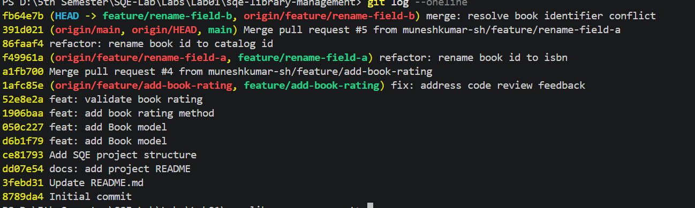

# Git Workflow Notes

## Task 3 — Deliberate Merge Conflict

### Cause of the Conflict

The merge conflict occurred because two branches modified the same lines
in `src/book.py` differently.

The `feature/rename-field-a` branch renamed `book_id` to `isbn`,
while the `feature/rename-field-b` branch renamed `book_id` to
`catalog_id`.

After the first branch was merged into `main`, Git could not automatically
combine the different changes from the second branch.

### Conflict Resolution

The conflict was first reproduced locally by merging `main` into
`feature/rename-field-b`.

Git marked `src/book.py` as conflicted using conflict markers:

- `<<<<<<< HEAD`
- `=======`
- `>>>>>>> main`

The conflict was resolved manually by keeping `isbn` as the book identifier
and removing the conflict markers.

The resolved file was then staged and committed, and the updated branch
was pushed to GitHub.

### Result

The merge conflict was successfully resolved locally and the GitHub pull
request was updated with the conflict resolution.

---

## Task 4 — Commit Hygiene Audit

### Last 10 Commits

The last 10 commits were:

```text
fb64e7b merge: resolve book identifier conflict
391d021 Merge pull request #5 from muneshkumar-sh/feature/rename-field-a
86faaf4 refactor: rename book id to catalog id
f49961a refactor: rename book id to isbn
a1fb700 Merge pull request #4 from muneshkumar-sh/feature/add-book-rating
1afc85e fix: address code review feedback
52e8e2a feat: validate book rating
1906baa feat: add book rating method
050c227 feat: add Book model
d6b1f79 feat: add Book model

---

### 📸 Task 4 Screenshot



